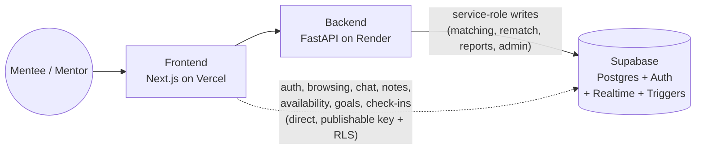

# Concord

A mentorship-matching platform. Mentees (looking for guidance on a career, field, or path) and mentors (who've already walked that path) build profiles, rank the other side by how well their profiles overlap, and get matched using the **Gale-Shapley stable matching algorithm** - not a plain similarity score.

**Live app:** https://concord-liard.vercel.app
**Backend API:** https://concord-api-8645.onrender.com
*(both hosted on free tiers - the API may take ~30s to wake up on first request)*

## Features

**Getting matched**
- **Email/password auth** via Supabase, with a mentee/mentor role captured at signup
- **Separate profile shapes for each side** - a mentee describes what guidance they're seeking, a mentor describes what they mentor in and their availability - both can tag shared lived-experience circumstances (first-gen, career-switcher, immigrant background, under-resourced school access)
- **Explainable match suggestions** - a rule-based score (word overlap on free text, weighted 70%, plus tag overlap, weighted 30%) ranks the other side for you, deliberately not an LLM/embedding call, so it stays cheap and the reasoning behind a suggestion is always inspectable. A dedicated match-explanation view breaks the score down into the actual shared words/tags, not just a number.
- **Preference ranking** - reorder your suggested list however you actually want it, then lock it in
- **Gale-Shapley matching, run in rounds** - a mentee-proposing deferred-acceptance algorithm (the "hospital/residents" variant, so a mentor availability count above 1 is respected). A `matching_rounds` state machine (`preferences_open` → `preferences_locked` → `matching_in_progress` → `results_available` → a fresh round) is advanced manually by the app's one admin account. Each run only considers the currently-unmatched pool and tops up mentor capacity incrementally - existing active matches are never wiped and recomputed.
- **Algorithm transparency page** (`/how-it-works`) - a written walkthrough plus a fully interactive client-side sandbox that traces a small Gale-Shapley example step by step

**Once matched**
- **Match reveal screen** with an icebreaker drawn from the shared match reasons
- **In-app chat**, written directly from the frontend against Supabase with Realtime (`postgres_changes`) so messages appear live with no polling
- **Availability picker** (day/time-of-day tags) with client-side overlap highlighting
- **Shared goals & milestones** (capped at 3 active goals) and a **session log** with private post-session check-ins visible only to the person who wrote them
- **Private notes** on the match, attributed "You" / "Your mentor" / "Your mentee"
- **Live notification feed** - a `NotificationBell` plus a full feed page, populated entirely by Postgres triggers (`on_match_created`, `on_message_created`) so a notification fires regardless of whether the insert came from the backend or a direct frontend write
- **Trust & safety** - rematch requests (reason logged privately, match quietly ends), block, per-message and per-match reporting, and a public community-guidelines page

**Admin (single-operator)**
- An admin dashboard assembling round status, all reports, and mentor capacity in one view (needs the service-role client, since RLS alone can't give even the admin account a cross-user read)

- **Row Level Security on every table** - profiles are browsable by any authenticated user; chat, notes, availability, goals, and check-ins are readable only by the two people in the match; preference rankings, reports, and check-ins are private to their owner.

## Tech stack

- **Frontend:** Next.js 16 (App Router), React 19, Tailwind CSS v4, deployed on Vercel
- **Backend:** FastAPI (Python), deployed on Render
- **Database & auth:** [Supabase](https://supabase.com) - Postgres with Row Level Security and Auth

## Architecture



## Architecture notes

- **Two Supabase clients, kept deliberately separate:** the backend uses a service-role ("admin") client for every write that needs to cross RLS boundaries (matching runs, rematch, reports, admin dashboard), bypassing RLS entirely - so the backend's own ownership checks (`get_user_id`/`require_admin` in `auth.py`) are the real security boundary for those calls, not the database. Anything that RLS alone can fully express - chat, notes, availability, goals, check-ins, browsing profiles - is written and read directly from the frontend with the publishable ("anon") key, no backend round-trip needed, and *is* enforced by RLS since that client has no special privilege.
- **Preference ranking is a plain, explainable score, not an AI call.** `matching.py`'s `score_pair()` is Jaccard word-overlap on free text plus tag overlap - the same "rule-based over black-box" preference documented in `uni-app-tracker`'s own DEVLOG. It means a match can always be explained ("you both mentioned X, and you share tag Y") instead of trusting an opaque model score.
- **The actual Gale-Shapley run is a pure function** (`gale_shapley.py`, no DB or network calls inside it) that only sees ranked ID lists and mentor capacities - `rounds.py`'s admin-gated state machine fetches locked preferences and current match load, calls it, and inserts only the newly-matched rows.
- **Notifications are trigger-driven, not app-driven.** Two Postgres triggers (`on_match_created`, `on_message_created`) insert into `notifications` directly at the database level, so a notification fires no matter which client performed the write that caused it.

For the real story of what broke and how it got fixed - a deploy that 404'd despite a clean build, a monorepo environment-variable suggestion that almost put a database-bypassing secret in the wrong project, a CORS scare that turned out to be a transient restart, and a security pass that found a real rate-limiting gap - see **[DEVLOG.md](DEVLOG.md)**.

## Running it locally

### 1. Supabase project

Create a Supabase project, then run `backend/schema.sql` in its SQL editor to create the profile/preference/matches tables and their RLS policies.

Grab three values from Project Settings → API: the project URL, the publishable key, and the service-role/secret key (careful - this bypasses RLS, backend-only).

### 2. Backend

```
cd backend
python -m venv venv
venv\Scripts\activate        # Windows
pip install -r requirements.txt
pip install -r requirements-dev.txt   # only needed to run the test suite
```

Copy `.env.example` (repo root) to `.env` and fill in `SUPABASE_URL`, `SUPABASE_PUBLISHABLE_KEY`, `SUPABASE_SECRET_KEY`, and `ADMIN_EMAIL` (the one account allowed to advance a matching round and access admin-only views).

```
uvicorn app.main:app --reload --port 8000
```

Run the test suite with `python -m pytest` from `backend/`.

### 3. Frontend

```
cd frontend
npm install
```

Create `frontend/.env.local` with `NEXT_PUBLIC_SUPABASE_URL`, `NEXT_PUBLIC_SUPABASE_PUBLISHABLE_KEY` (same two Supabase values as above), `NEXT_PUBLIC_BACKEND_URL` (`http://localhost:8000` for local dev), and `ADMIN_EMAIL` (same value as the backend's, used server-side to decide whether to show the admin round-control button and the admin dashboard link - not prefixed with `NEXT_PUBLIC_`, since it's only ever read in a Server Component).

```
npm run dev
```

Visit `http://localhost:3000`.

## What I learned building this

This was my third project, built after a CRUD app and an AI-integrated study platform, and the first one centered on a real algorithm (Gale-Shapley) rather than gluing together CRUD and an LLM call. Along the way it took me through:

- Implementing a classical algorithm from its actual formal description (mentee-proposing deferred acceptance, generalized to mentor capacity above 1) rather than a simplified version, and unit-testing it against the specific properties that make a matching *stable* - not just "does it produce an output"
- Designing two genuinely different-shaped profile tables instead of forcing one shared shape, because mentee and mentor data really are different
- A deploy debugging session where the platform's build log, its file-tree detection, and its actual persisted settings all disagreed with each other - and the fix was verifying the real setting, not trusting any one signal
- Catching a monorepo environment-variable auto-suggestion that would have put a service-role secret into a frontend project if accepted without checking what it actually was
- Running a real security pass on my own code a second time on a second project, and finding the exact same class of gap (missing rate limiting) that a first pass on a different project had already taught me to look for

## License

MIT - see [LICENSE](LICENSE).
